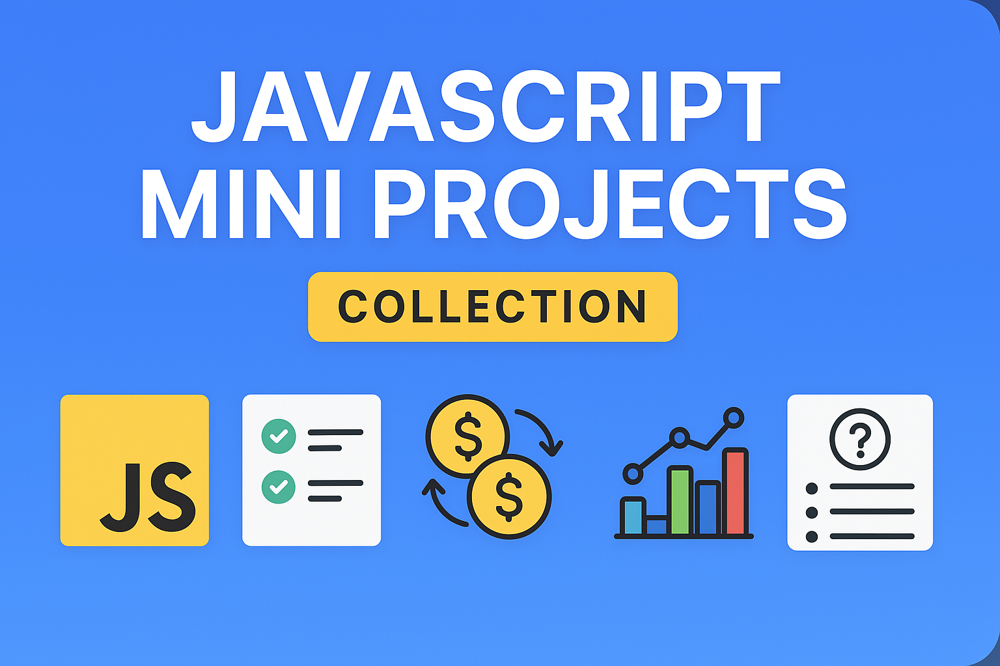

# JavaScript Mini Projects Collection

This repository contains a collection of practical and interactive JavaScript mini-projects created to strengthen core programming skills and build hands-on experience with modern web development.

Each project focuses on real-world functionality, problem-solving, and writing clean, maintainable code.  
Together, they demonstrate consistent growth in JavaScript proficiency and front-end development.

---

## 🚀 Included Projects
- Rock–Paper–Scissors Game  
- To-Do Application  
- Currency Converter (with real API integration)  
- Expense Tracker (with filters & charts)  
- Quiz App (timer, progress bar, answer validation)
- Weather App
- Typing Speed Test
- Additional small interactive applications

---

## 🛠️ Technologies Used
- HTML5  
- CSS3  
- JavaScript (ES6+)  
- Fetch API  
- LocalStorage  
- Chart.js (for supported projects)

---

## 🎯 Purpose of This Repository
This collection documents my learning journey in JavaScript by building small yet meaningful projects.  
It serves as a solid foundation for progressing into more advanced areas like:

- TypeScript  
- Node.js & Express  
- Next.js  
- Front-end frameworks  
- Full-stack web development

Feel free to explore the code, test the projects, or fork the repository for your own learning and experimentation.

---

## 📩 Feedback
If you have any suggestions, improvements, or feedback, feel free to open an issue or submit a pull request.
